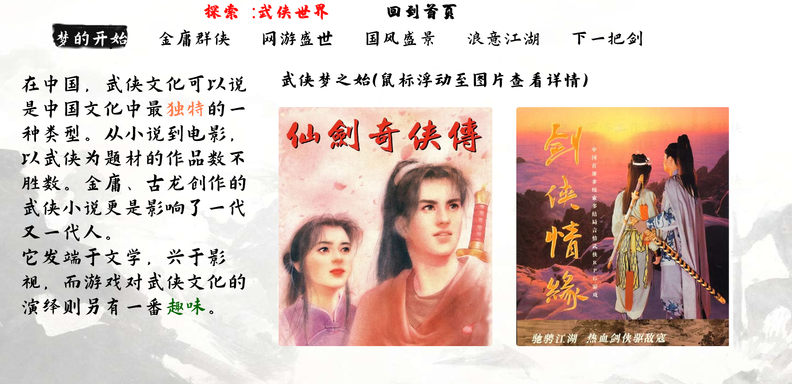
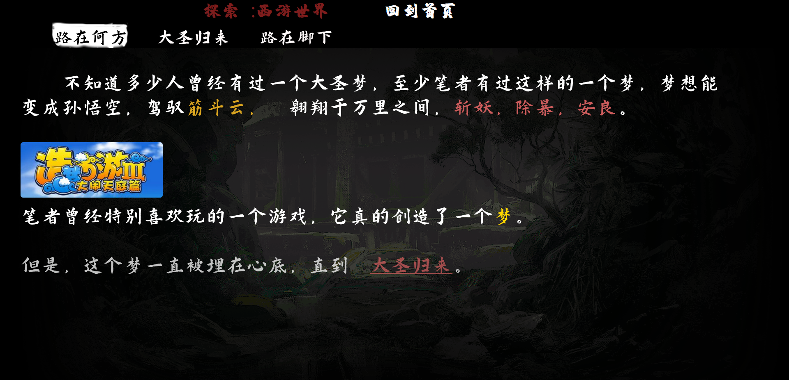
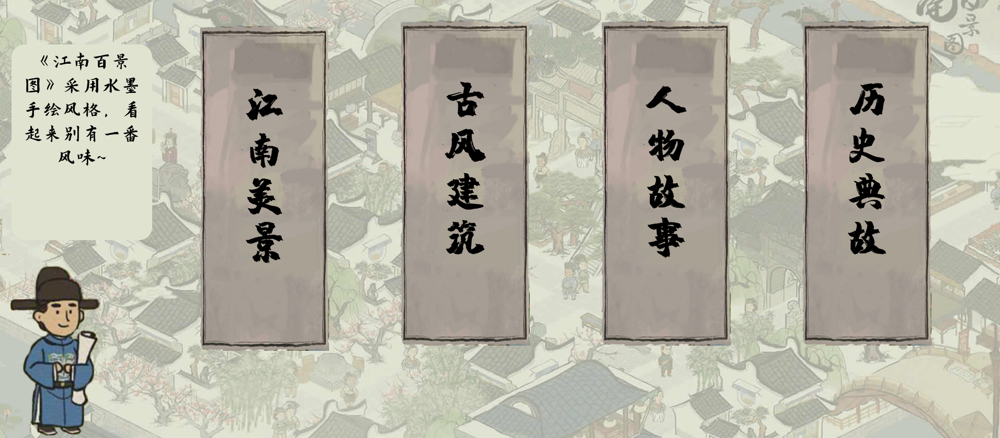
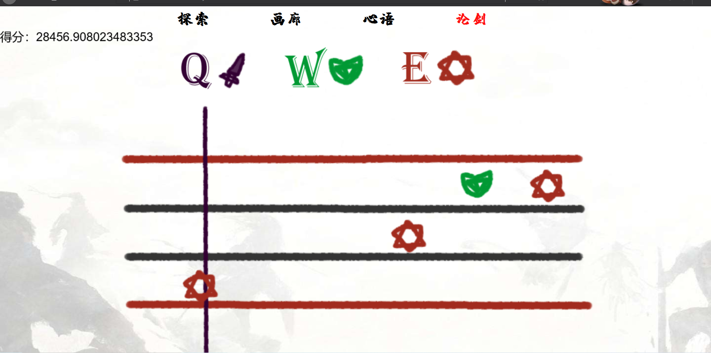

### 整理自己的代码和生活

展示视频：

https://www.bilibili.com/video/BV1RK4y1Q7vF

以下为提交的设计文档。

所选主题：游戏 （游戏与传统文化）

主要设计理念：

本网页定位上是一个**展示性**网页，通过网页介绍游戏与传统文化的关系。

整个网页就是一个水墨画的画布，基于这一点，本网页设计中都遵循的理念要素：

1.  无滚动条，既然整个网页就是一个画布，就不应该有滚动条，因此网页大部分元素采取相对定位，以确保全部内容能在一个页面呈现。

2.  元素动态呈现，网页上的任何元素并不能凭空出现，也不能凭空消失，所以在呈现内容的时候几乎对所有元素采取了动态淡入淡出，主由有CSS3的渐变实现，对于CSS实现不了的，由JS实现动画。

3.  为了使得背景可以按照动态呈现，本网页采用了最前沿的WEBGL2.0渲染技术。

本网页分为四个大模块：

1.  探索模块

>   探索模块是本网页的内容主题，其下又分了3个部分来介绍游戏与传统文化的关系：

1.  江湖有梦：

>   江湖有梦介绍了武侠游戏这一大类，采用了左侧为简介，右侧为配图的格式。其中配图背后也配有文字。

>   江湖有梦这个视图采用的是非线性的内容呈现，用户可以在tab栏中点击自己想看的内容。

>   

1.  重走西游

>   这个模块采用的是线性方式呈现内容，通过动画和一些情景再现，介绍了西游题材游戏《黑神话:悟空》

>   

1.  醉意江南：

>   该模块介绍了模拟经营游戏《江南百景图》

>   由左下角的严大人为用户带来江南百景图的游戏玩法，内容等介绍

>   

1.  画廊

>   画廊主要陈列了一些游戏的图片。

>   采用Ajax获取陈列的图片，同样是左下角的严大人为我们介绍图片的内容（为了展示效果，只获取了自带的模拟Ajax数据
>   gallery.json）

三. 心语

这个模块主要是陈列一些评论，也是采用Ajax获取评论列表（为了展示效果，只获取了自带的模拟Ajax数据
comment.json）项目文件结构

| Assets\\      | 资源文件夹           |
|---------------|----------------------|
| Image\\       | 图片文件夹           |
| Comment.json  | 模拟Ajax评论数据     |
| Galley.json   | 模拟Ajax画廊数据     |
| Hualang.html  | 画廊页面             |
| Index.html    | 主页                 |
| Jiangnan.html | 江南视图             |
| Pixi.js       | Webgl绘图库          |
| Pro.html      | 心语页面             |
| Wuxia.html    | 武侠页面             |
| Xiyou.html    | 西游页面             |
| Lunjiang.html | 论剑视图（已被咕咕） |

论剑视图

在完成整个项目之后，我们发现缺失对这些游戏中音乐鉴赏的一部分，而论剑视图就提供了一个非常简陋的音游，来领略音乐。

由于时间仓促，只写一个西游记序曲的一部分谱。

额外的说明：

关于字体，本网页选用的是
字魂手书体和演示秋鸿楷。这两种字体均在网上找到，仅用来展示，并且为了保证字体能够顺利加载，在部署时我们会采用字蛛对字体文件进行精简，提交的文件中的字体为未精简的原始字体。
